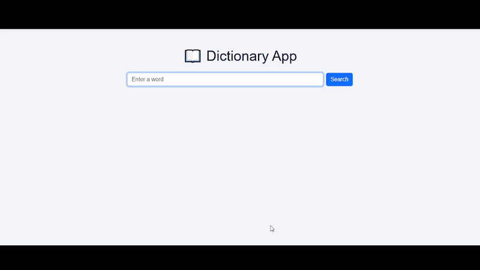

Project Description

A responsive web application built with Python Flask that allows users to search for any English word and view its definitions, phonetics, examples, and synonyms. Data is fetched in real-time from the Free Dictionary API. This project demonstrates backend API integration, frontend templating, and responsive UI design.

---

Features

Search for any English word

View phonetics, definitions, examples, and synonyms

Clean, responsive UI with Bootstrap

Error handling for words not found

Interactive search experience

---

## Demo

Technologies Used

Python 3.x

Flask

Requests library

HTML/CSS (Jinja templates)

Bootstrap CDN

---

Setup Instructions

1. Clone the repository:

git clone <your-repo-link>

2. Navigate to the project folder:

cd dictionary_app

3. Install dependencies:

pip install flask requests

4. Run the app:

python app.py

5. Open in browser:

http://127.0.0.1:5000

6. Type a word and see definitions, examples, and synonyms.